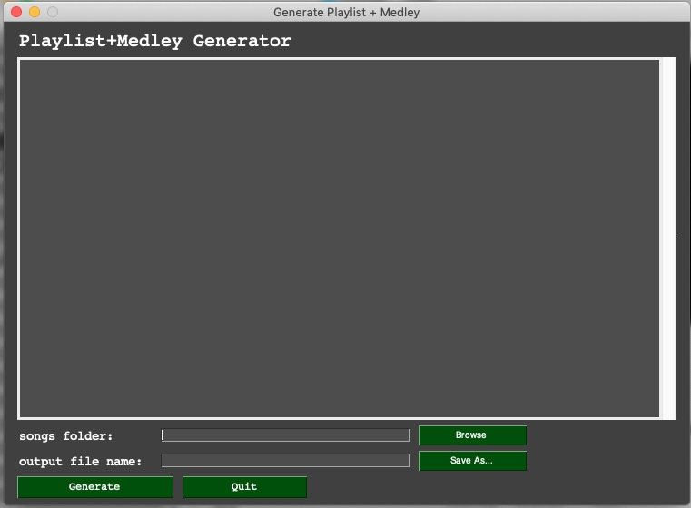

# playlistGen

Takes a path to audio files and outputs two audio files into disk:
1. playlist of randomized 90sec song excerpts preceeded by 1sec of beep + silence.
2. medley of 5sec excerpts per song from playlist separated by 3sec

## playlistGenCLI
Command line interface
Usage: 
```python playlistGen.py -p path-to-songs -o name-of-outputfile-with-extension.mp3```

## playlistGen.py
User-GUI 
Usage: 
```pythonw playlistGen.py```




### demos

#### playlistGenCLI
https://user-images.githubusercontent.com/26675866/160858092-d106f947-fc82-42a2-8e2c-db4c1c462a6c.mp4

#### playlistGen.py (GUI)
https://user-images.githubusercontent.com/26675866/160858439-69a368c9-c88a-4a7f-be51-b55fb5ff752d.mp4

